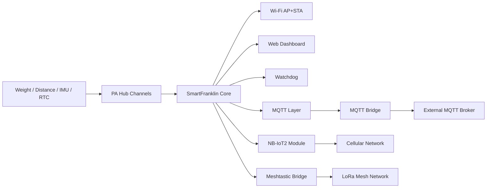

# SmartFranklin

[](https://platformio.org/)
[](https://www.arduino.cc/)
[](https://docs.m5stack.com/en/core/m5stickc_plus2)
[](LICENSE)

SmartFranklin is an ESP32 IoT controller project for **M5Stick C Plus2**, focused on sensing, connectivity, and resilient remote operation.

---

## Key Features

- Wi-Fi dual mode (**AP + STA**)
- MQTT client layer + MQTT bridge
- Web dashboard (status/config)
- Sensor support (weight, distance, tilt/IMU, RTC)
- PA Hub channel mapping (I2C multiplexer)
- Optional **NB-IoT** (cellular MQTT + GNSS)
- Optional **Meshtastic** bridge
- Watchdog-based task health monitoring

---

## Architecture



---

## Project Layout

- `include/` — module headers
- `src/` — module implementations
- `boards/` — custom board definitions
- `platformio.ini` — build/upload/deps configuration

---

## Build & Flash (macOS)

```bash
cd /Volumes/Ra/Development/SmartFranklin
pio run -e m5stick-c-plus2
pio run -e m5stick-c-plus2 -t upload
pio device monitor -b 115200
```

---

## Documentation (Doxygen)

```bash
cd /Volumes/Ra/Development/SmartFranklin
brew install doxygen graphviz
doxygen -g Doxyfile   # first time only
doxygen Doxyfile
open docs/html/index.html
```

Use:
- `INPUT = include src`
- `RECURSIVE = YES`

---

## Notes

- If using custom board config, confirm `platformio.ini` board selection matches `boards/m5stick-c-plus2.json`.
- For remote deployments, validate fallback paths (AP mode / NB-IoT / Meshtastic) before field use.

---

## License

MIT License  
Copyright (c) 2026 Laurent Burais