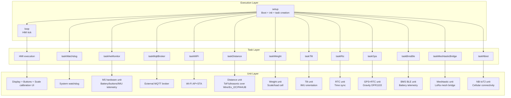

# SmartFranklin

[](https://platformio.org/)
[](https://www.arduino.cc/)
[](https://docs.m5stack.com/en/core/m5stickc_plus2)
[](LICENSE)
[](https://lburais.github.io/SmartFranklin/)

SmartFranklin is an ESP32 IoT controller for **M5Stick C Plus2**, organized as concurrent execution blocks (main loop + FreeRTOS tasks) with explicit unit ownership.

---

## Task-Centric Capabilities

- Main loop execution: HMI rendering, button event handling, and scale calibration state machine
- Connectivity execution blocks: Wi-Fi AP+STA lifecycle and external MQTT session
- Sensor execution blocks: distance, weight, tilt, RTC, and GPS acquisition pipelines
- Optional radio execution blocks: Meshtastic bridge (LoRa mesh) and NB-IoT2 cellular fallback
- Battery and board telemetry execution blocks: BLE BMS metrics and M5 hardware status publication
- Supervision execution block: watchdog-driven liveness checks and recovery signaling
- Capability-gated startup: task creation is conditioned by detected hardware paths and runtime configuration

---

## Task-Oriented Architecture



### Execution-to-Unit Mapping

| Execution Block | Owned Units / Services | Primary Responsibility |
|---|---|---|
| `loop` + `HMI` | LCD, buttons, calibration workflow | Local operator interface, screen navigation, calibration state transitions |
| `taskWatchdog` | System watchdog | System liveness supervision and recovery signaling |
| `taskHwMonitor` | M5 internal telemetry | Board-level metrics publication (battery/buttons/IMU) |
| `taskMqttBroker` | External MQTT endpoint | MQTT session lifecycle, publish/subscribe, command ingress |
| `taskWiFi` | Wi-Fi AP + STA | Connectivity lifecycle management and reconnection policy |
| `taskDistance` | Distance sensors (Wire/Ex_I2C/PAHUB) | Periodic distance acquisition and publication |
| `taskWeight` | Scale/load-cell path | Weight acquisition, calibration application, and publication |
| `taskTilt` | IMU tilt/orientation | Pitch/roll acquisition and publication |
| `taskRtc` | RTC clock | Timekeeping and synchronization duties |
| `taskGps` | Gravity DFR1103 (GNSS + RTC) | GNSS fix/time/position acquisition and publication |
| `taskBmsBle` | BLE BMS | Battery voltage/current/SOC acquisition and publication |
| `taskMeshtasticBridge` | Meshtastic C6L path | Mesh transport bridging with MQTT integration |
| `taskNbiot` | NB-IoT2 modem | Cellular transport path and fallback connectivity |

Boot-time task creation is capability-gated: some tasks (for example distance, weight, Meshtastic, NB-IoT) are started only when probing and configuration confirm a valid hardware path.

---

## Project Layout (Task View)

- `src/main.cpp` — bootstrap sequence, dependency initialization, and task creation policy
- `src/hmi.cpp` + `include/hmi.h` — main-loop HMI execution unit (display + buttons + calibration)
- `src/task_*.cpp` + `include/tasks.h` — FreeRTOS execution blocks and shared task contracts
- `src/task_distance.cpp` / `src/task_weight.cpp` / `src/task_tilt.cpp` / `src/task_rtc.cpp` / `src/task_gps.cpp` — sensing execution modules
- `src/task_mqtt_broker.cpp` / `src/task_wifi.cpp` / `src/task_meshtastic_bridge.cpp` / `src/task_nbiot.cpp` — connectivity and transport execution modules
- `src/task_bms_ble.cpp` / `src/task_hw_monitor.cpp` / `src/task_watchdog.cpp` — battery, board telemetry, and supervision execution modules
- `include/` — shared subsystem interfaces consumed by execution blocks
- `boards/` — PlatformIO custom board definitions
- `platformio.ini` — environment matrix, build flags, dependencies, upload/monitor configuration

---

## Build & Flash (macOS)

```bash
cd /Volumes/Ra/Development/SmartFranklin
pio run -e m5stick-c-plus2
pio run -e m5stick-c-plus2 -t upload
pio device monitor -b 115200
```

---

## Documentation (Doxygen)

```bash
cd /Volumes/Ra/Development/SmartFranklin
brew install doxygen graphviz
doxygen -g Doxyfile   # first time only
doxygen Doxyfile
open docs/html/index.html
```

Use:
- `INPUT = include src`
- `RECURSIVE = YES`

---

## Notes

- If using custom board config, confirm `platformio.ini` board selection matches `boards/m5stick-c-plus2.json`.
- For remote deployments, validate fallback paths (AP mode / NB-IoT / Meshtastic) before field use.

---

## License

MIT License  
Copyright (c) 2026 Laurent Burais