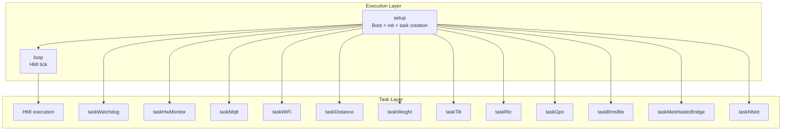

# SmartFranklin

[](https://platformio.org/)
[](https://www.arduino.cc/)
[](https://docs.m5stack.com/en/core/m5stickc_plus2)
[](LICENSE)
[](https://lburais.github.io/SmartFranklin/)

SmartFranklin is an ESP32 IoT controller for **M5StickC Plus2** built around concurrent execution blocks: a lightweight `loop()` plus dedicated FreeRTOS tasks.

---

## What It Does

- Runs a local HMI (screen navigation, button handling, scale calibration workflow)
- Collects telemetry from distance, weight, tilt, RTC, GPS, BLE BMS, and board sensors
- Manages Wi-Fi AP/STA connectivity and a unified MQTT runtime (`taskMqtt`)
- Bridges optional transports (Meshtastic and NB-IoT2)
- Applies capability-gated startup based on detected hardware and configuration

---

## Runtime Architecture



---

## Execution Block Mapping

| Execution Block | Responsibility |
|---|---|
| `loop` + `HMI` | Local operator UI, screen updates, button actions, calibration flow |
| `taskWatchdog` | Liveness supervision and recovery signaling |
| `taskHwMonitor` | M5 board telemetry publication |
| `taskMqtt` | Unified MQTT runtime (embedded local broker + external client path) |
| `taskWiFi` | AP/STA connectivity lifecycle and reconnection |
| `taskDistance` | Distance acquisition and publication |
| `taskWeight` | Weight acquisition, calibration application, and publication |
| `taskTilt` | Pitch/roll acquisition and publication |
| `taskRtc` | RTC timekeeping and publication |
| `taskGps` | GNSS/RTC acquisition and publication |
| `taskBmsBle` | BLE BMS acquisition and publication |
| `taskMeshtasticBridge` | Meshtastic bridge integration |
| `taskNbiot` | NB-IoT2 transport path |

Boot-time task creation is capability-gated: selected tasks are created only when hardware probing and runtime configuration confirm a valid path.

---

## Project Layout

- `src/main.cpp`: system bootstrap, dependency initialization, task creation
- `src/hmi.cpp`, `include/hmi.h`: HMI runtime
- `src/task_*.cpp`, `include/tasks.h`: FreeRTOS task entrypoints and contracts
- `src/mqtt.cpp`, `include/mqtt.h`: MQTT API implementation
- `src/task_mqtt.cpp`: unified MQTT execution task
- `src/gps.cpp`, `include/gps.h`: DFR1103 integration
- `src/i2c_bus.cpp`, `include/i2c_bus.h`: I2C topology and bus-path detection
- `src/task_distance.cpp`, `src/task_weight.cpp`, `src/task_tilt.cpp`, `src/task_rtc.cpp`, `src/task_gps.cpp`: sensor/runtime tasks
- `src/task_wifi.cpp`, `src/task_meshtastic_bridge.cpp`, `src/task_nbiot.cpp`: connectivity/transport tasks
- `src/task_bms_ble.cpp`, `src/task_hw_monitor.cpp`, `src/task_watchdog.cpp`: supervision and telemetry tasks
- `include/`: shared interfaces
- `boards/`: PlatformIO board definitions
- `platformio.ini`: environments, build flags, dependencies

---

## Build And Flash

```bash
cd /Volumes/Ra/Development/SmartFranklin
pio run -e m5stick-c-plus2
pio run -e m5stick-c-plus2 -t upload
pio device monitor -b 115200
```

---

## Documentation

```bash
cd /Volumes/Ra/Development/SmartFranklin
make docs
make docs-open
```

Alternative direct Doxygen flow:

```bash
cd /Volumes/Ra/Development/SmartFranklin
doxygen Doxyfile
open docs/html/index.html
```

---

## Notes

- Confirm `platformio.ini` board selection matches `boards/m5stick-c-plus2.json`.
- Validate fallback transport paths (AP mode, NB-IoT, Meshtastic) before field deployment.

---

## License

MIT License  
Copyright (c) 2026 Laurent Burais
